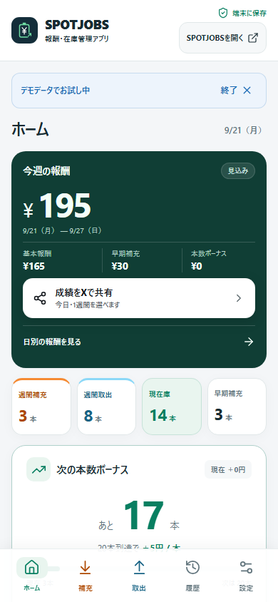
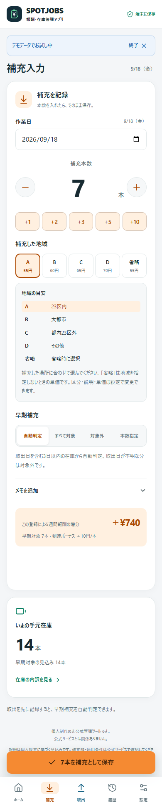
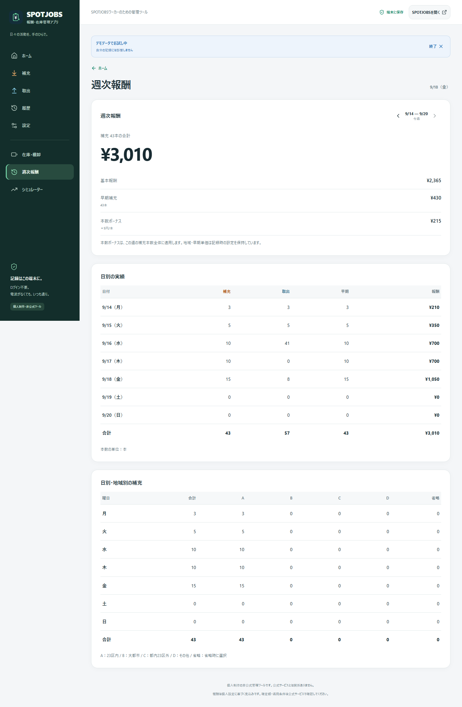
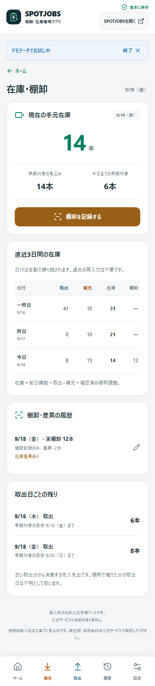
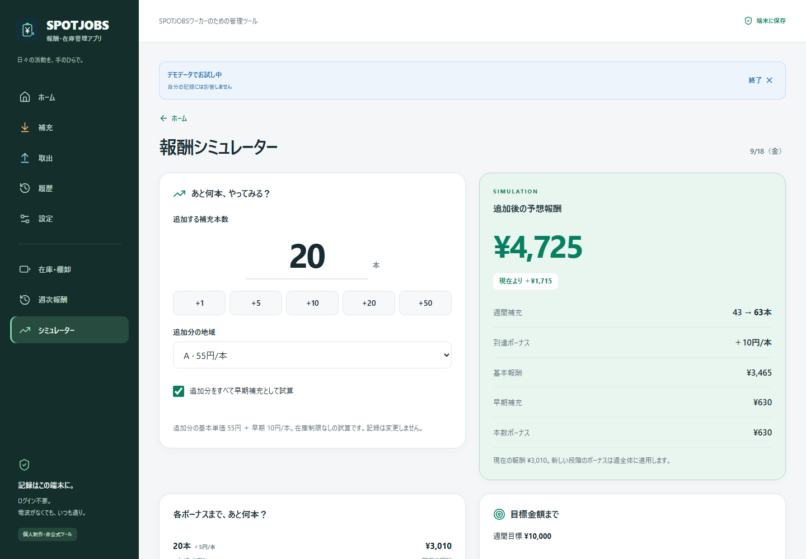

# SPOTJOBS報酬・在庫管理アプリ

補充と取出を手早く記録して、「今週いくら？」「あと何本？」を確認する、SPOTJOBSワーカー向けの個人制作・非公式Webアプリです。

- [公開アプリ](https://spotjobs-reward-inventory-manager.vercel.app)
- [GitHub](https://github.com/shunsoco-stack/spotjobs-reward-inventory-manager)
- [ポートフォリオ・制作背景](docs/portfolio.md)
- [ホームページ掲載用プロンプト・紹介文](docs/publish-copy.md)
- [公開・品質確認レポート](docs/verification.md)

## 概要

スマートフォンでの入力しやすさを中心に、補充・取出・報酬・在庫をひとつの画面構成にまとめました。本数を入力すると、基本報酬、早期補充、週間本数ボーナス、手元の在庫を計算します。

ログイン不要で利用できます。データは利用中のブラウザに保存し、アカウント登録、公式サービスとの連携、クラウド同期は行いません。個人の記録とは別に、デモデータで操作を試せます。

## 作った理由

実際のSPOTJOBSの活動をスプレッドシートで管理する中で、移動中のセル操作や報酬の暗算を減らしたいと考えたことが出発点です。「もう少し続けるか」「あと何本で目標に届くか」を、その場で判断できる道具を目指しました。

参考資料として提供された報酬早見表の考え方も取り入れ、表計算の内容をそのまま並べるのではなく、本数入力、報酬確認、在庫確認という使う場面ごとに整理しています。参考記事の本文や画像をアプリ内へ転載したものではありません。

## 主な機能

| 機能 | できること |
| --- | --- |
| ホーム | 週間報酬の内訳、補充・取出本数、現在庫、目標、次のボーナスを確認 |
| 補充入力 | 大きな数字入力、増減ボタン、+1・+2・+3・+5・+10、地域選択と地域ごとの説明、早期対象、メモ |
| 取出入力 | 日付と本数を記録し、在庫と早期判定に反映 |
| 履歴 | 日付・地域・作業種類で絞り込み、編集・削除、直前の変更を取り消し |
| 週次報酬 | 基本・早期・本数ボーナスの内訳、日別実績、日別・地域別の補充集計 |
| 在庫・棚卸 | 今日・昨日・一昨日の在庫、取出日ごとの残り、棚卸差異を確認 |
| シミュレーター | 追加本数・地域・早期条件を変更し、報酬と目標までの本数を試算 |
| 設定 | 地域の名称・説明・単価、早期条件、ボーナス段階、週開始曜日、目標、テーマ |
| データ管理 | JSONバックアップ・復元、CSV出力・列割り当て付き取込 |
| スクショ取り込み | ジョブ履歴の画像を端末内で読み取り、日時・種類・本数・店舗名を確認・修正してまとめて登録 |
| X共有 | 「今日」または「1週間」を選び、集計内容を確認してからXの投稿画面を開く |
| SPOTJOBSへのアクセス | 各画面の右上から、https://app.spot.jobs/ をワンタップで外部リンクとして開く |

ライト、ダーク、端末設定に合わせたテーマを選べます。入力ミスや保存失敗時には内容を確認でき、保存処理が成功するまで入力内容を保持します。

作業の色は**補充＝オレンジ、取出＝水色**です。入力・ナビゲーション・履歴・集計で統一し、色に加えて文字とアイコンでも種類を示しています。

「SPOTJOBSを開く」は別タブで開き、元の入力画面を残します。ホーム画面に追加したPWAでの表示先は端末・ブラウザの動作に従います。公式サービスへのログインや通信は開いた先で行い、記録データをリンクへ付加しません。

### ジョブ履歴のスクリーンショットから登録

1. SPOTJOBSのジョブ履歴で「完了」を開き、完了時間・作業の種類・本数がすべて写るスクリーンショットを保存します。
2. このアプリの補充・取出・履歴、またはホーム下部から「スクショから取り込む」を開きます。
3. JPEG・PNG・WebPを最大5枚選択します。1枚12MB、2,400万画素までです。
4. 読み取り候補の日付・秒までの時刻・補充／取出・本数・店舗名を確認し、誤読を修正します。不要な候補はチェックを外します。
5. 補充の地域・早期対象を確認し、確認欄にチェックしてまとめて保存します。店舗名はメモへ保存され、登録後は通常の履歴から編集・削除できます。

日本語・英語の文字認識はTesseract.jsで**端末内**で行います。画像や認識文字を外部APIへ送信せず、原画像を記録データやバックアップに保存しません。文字認識用プログラムと言語データもアプリと同じ配信元から取得します。初回の読み取りには通信が必要です。一度読み取りを完了し、必要な資産が保存された環境ではオフラインでも再利用できます（Chromiumで確認、保存領域の削除後は再取得が必要）。読み取り中は中止でき、閉じると処理を中止します。

完了日時と種類が一致するスクショ由来の記録は、重複候補として自動で除外します。読み取り結果を修正して保存した場合も、元の読み取り識別子を保持します。通常入力・CSVなどの同日同種の記録は自動で同一作業と断定できないため、重複の可能性を表示します。同じ秒・同じ種類で別ジョブが発生した場合は通常入力から登録してください。

**地域、早期対象、報酬額は画像から推測しません。** 「3日以内で＋10円」などは一般的な案内文として扱います。地域は前回の選択、早期補充は取出記録による自動判定が初期値です。必要に応じて地域・早期対象本数を修正してください。新しい補充記録には現在の地域・早期単価と既存の週条件を保存するため、画像の概算報酬とは異なる場合があります。画像が不鮮明、途中で切れている、画面構成が異なる場合は読み取れないことがあります。候補を確認するまで保存しません。

### 今日・1週間の成績をXへ共有

ホームの「成績をXで共有」から**今日**または**1週間**を選び、補充・取出・早期補充・見込み報酬を投稿前に確認できます。1週間はホームで表示中の週が対象なので、過去週へ移動してその週の成績も共有できます。次の週間本数ボーナスまでの残り本数も表示します。デモモードの集計には「デモ」と明記し、個人の実績と取り違えないようにしています。

「Xで共有画面を開く」を押すと、集計文を入れた`x.com`の投稿画面を別タブで開きます。**投稿は自動で確定せず**、X側で内容を確認して投稿します。店舗名、メモ、個別の履歴、現在庫は共有文へ含めません。プレビューの表示までは端末内で完結し、Xの投稿画面を開く操作にはネットワーク接続が必要です。

## 報酬計算

```text
週間報酬 ＝ 基本報酬 ＋ 早期補充ボーナス ＋ 週間本数ボーナス
基本報酬 ＝ 各補充記録の本数 × その記録の地域単価 の合計
早期補充ボーナス ＝ 各記録の対象本数 × その記録の早期単価 の合計
週間本数ボーナス ＝ 週間補充総数 × 到達段階の追加単価
```

作業日は日本時間で扱います。週は初期設定で月曜〜日曜ですが、開始曜日を変更できます。

補充記録には、地域単価、早期単価、早期対象日数、週開始日、本数ボーナス表を保存します。設定変更によって過去の記録を現在の単価で再計算しません。すでに記録がある週では、その週の区切りとボーナス表を維持し、新しい週から変更した条件を使います。

## 地域別単価

以下は**個人管理用の変更可能な初期値**です。公式料金表の提供や報酬額の保証ではありません。

| 地域名 | 初期説明 | 初期単価 |
| --- | --- | ---: |
| A | 23区内 | 55円／本 |
| B | 大都市 | 60円／本 |
| C | 都内23区外 | 65円／本 |
| D | その他 | 70円／本 |
| 省略 | 省略時に選択 | 55円／本 |

地域省略はAとは別の設定です。初期の入力地域は省略に設定してあり、地域名、説明、単価、入力時の初期地域を変更できます。

旧版のデータを読み込んだ場合は、旧版で使用していたB＝65円・C＝60円を含む設定を維持します。初期値への置き換えや過去の単価の入れ替えは行いません。

## 早期補充

初期設定は、**取出日を含む3日以内・対象1本につき10円**です。取出記録がある在庫を古い順に消費したと仮定し、早期対象の本数を推定します。

補充入力では「自動判定」「すべて対象」「対象外」「本数指定」を選べます。実際の条件と推定が異なる場合は手動で指定してください。取出日が不明な在庫や、取出未記録の本数には早期ボーナスを自動加算しません。

## 週間本数ボーナス

| 週間補充本数 | 初期追加単価 |
| --- | ---: |
| 0〜19本 | 0円／本 |
| 20〜49本 | 5円／本 |
| 50〜99本 | 10円／本 |
| 100〜149本 | 15円／本 |
| 150本以上 | 20円／本 |

到達した段階の単価を、その週の**全補充本数**に適用します。例えば49本から50本へ増えると、追加した1本分だけでなく、週間本数ボーナス全体も変わります。

設定は1〜10段階。最初の段階は0本、開始本数は重複しない昇順、追加単価は前段階以上とします。画面入力とデータ取込の両方で検証します。

## 「あと何本？」機能

次のボーナス段階までの残り本数と、その段階へ届いた場合の予想報酬を表示します。週間目標についても、選んだ地域と早期条件の下で、目標へ最初に届く追加本数を計算します。

基本単価だけで割り算せず、途中で本数ボーナスの段階が変わる場合も反映します。画面に試算条件を表示し、シミュレーターから変更できます。

## 在庫管理

```text
現在庫 ＝ 前日繰越 ＋ 取出 − 補充 ＋ 反映済みの棚卸調整
```

今日・昨日・一昨日の表示は、日付が変わると繰り越します。取出日ごとの残りと、今日までの早期対象も確認できます。

取出の記録が足りない場合は、理論在庫をマイナスのまま表示し、記録漏れを知らせます。不足分を自動的に0へ丸めたり、存在しない取出記録を作ったりしません。

## 棚卸

実際に数えた本数を記録し、記録上の在庫との差分を確認できます。初期状態は**確認記録のみ**で、棚卸しただけでは在庫を変更しません。

「棚卸数を在庫に反映する」を選ぶと、変更前後の本数と差異を確認してから反映します。確認のみ・反映済みの状態は履歴に残ります。棚卸で増えた在庫の取出日は不明として扱い、自動の早期対象から外します。

## 報酬シミュレーター

追加する補充本数、地域、追加分をすべて早期対象とするかを選び、次の内容を比較できます。

- 追加後の予想報酬と現在との差額
- 基本・早期・週間本数ボーナスの内訳
- 各ボーナス段階までの残り本数と到達時の報酬
- 週間目標へ届く追加本数

試算によって活動記録や在庫は変わりません。追加本数は在庫制限なしの仮定で計算します。

## PWA / Offline

本番ビルドはWeb App ManifestとService Workerを含みます。**初回はオンラインで開き、画面と必要なファイルの保存が完了してから**オフラインで入力・履歴・計算を利用できます。

- iPhone：Safariの共有メニューから「ホーム画面に追加」
- Android：ブラウザの「アプリをインストール」または「ホーム画面に追加」。対応環境では設定画面にもインストールボタンを表示

HTTPSまたはlocalhostで利用します。開発モードではService Workerを登録しません。初回アクセス前、キャッシュ削除後、ブラウザが保存領域を削除した後は、オンラインでの再読み込みが必要です。

## データ保存方式

記録と設定は、利用中のブラウザの**IndexedDB**へ保存します。活動記録をサーバーに送る機能、ログイン、クラウド同期はありません。ブラウザ・端末・URLが異なれば保存領域も別です。

保存はトランザクションの完了まで確認し、別タブで先に変更された場合は古い内容で上書きせず通知します。デモは個人データと分離しています。

旧localStorage版は、読み込み時に記録時の報酬条件を付けて移行します。旧棚卸は当時の動作に合わせて反映済みとして移行し、元のlocalStorageは移行元の控えとして保持します。

ブラウザデータの削除、端末故障、プライベートブラウズの終了などで記録が失われる場合があります。端末やURLを変える前に、JSONバックアップを保存してください。

## Backup / Restore

**JSON**は設定と全記録をまとめて保存する形式です。バックアップ作成日時、件数、記録期間を復元前に確認し、内容を確認してから現在のデータを置き換えます。復元前に現在のバックアップを保存できます。

**CSV**は表計算との受け渡しに使います。UTF-8、見出し行、引用符付きのカンマ・改行に対応し、日付・本数・作業種類・地域・早期対象・メモの列を割り当てて取り込みます。行ごとのエラーと内容を確認してから、既存記録へ追加します。日付には年が必要です。通常CSVの地域空欄は設定の初期地域を使い、新しい記録の条件として保存します。

このアプリから出力したCSVには、報酬条件・棚卸状態・ID・メモをそのまま復元するための**「記録データ（JSON）」列**が含まれます。この列があれば、その内容を優先します。表計算で通常列を編集し、その編集結果を読み込みたい場合は、この列を削除してから列割り当てで取り込んでください。CSVは設定全体のバックアップにはならないため、端末移行にはJSONを推奨します。

不正な形式、存在しない日付、不正な数値、重複ID、上限超過を検証します。取込エラーで既存データを消すことはありません。CSVの数式として扱われ得る文字列は、出力時に無効化します。

## Screenshots

2026年9月21日にVercel本番環境で撮影した実際の画面です。ホーム・補充入力・在庫の3枚はスマートフォン幅、週次報酬・シミュレーターの2枚はデスクトップ幅です。個人の作業履歴は使わず、アプリのデモモードで撮影しています。[撮影条件と画像の記録](docs/screenshots/capture.json)も保存しています。

### ホーム



### 補充入力



### 週次報酬



### 在庫・棚卸



### 報酬シミュレーター



## 使用技術

| 領域 | 技術 |
| --- | --- |
| UI | Next.js 16、React 19、TypeScript、CSS、Lucide |
| 保存 | IndexedDB、旧localStorageデータの移行 |
| スクリーンショット読取 | Tesseract.js 7、日本語・英語モデル、Web Worker / WebAssemblyによる端末内OCR |
| ファイル | JSONバックアップ、CSV解析・出力 |
| オフライン | Web App Manifest、Service Worker、静的エクスポート |
| 品質確認 | Vitest、fake-indexeddb、Playwright、TypeScript、ESLint、GitHub Actions |
| 配信構成 | Vercel対応の静的ホスティング設定 |

## Testing

Node.js 22以上を使用します。このディレクトリで実行してください。

```sh
npm ci
npm test
npm run typecheck
npm run lint
npm run build
```

主なテスト対象は、報酬の段階境界、週の区切り、単価保存、先入先出、負在庫、棚卸、シミュレーション、JSON移行・復元、IndexedDBの保存完了・競合、CSVの引用符・列対応・不正行です。スクショ取り込みでは日時・本数の解析、重複除外、補正後の重複、単価保存、OCRの中止・タイムアウト・資源解放も検証します。X共有では今日・1週間の集計文、デモ表記、共有対象外の情報、`x.com`投稿URLを検証します。公開テストは合成データを使い、IndexedDBの単体テストはfake-indexeddb上で行います。

テストファイルは `src/lib/core.test.ts`、`src/lib/storage.test.ts`、`src/lib/csv.test.ts`、`src/lib/job-screenshot.test.ts`、`src/lib/screenshot-ocr.test.ts`、`src/lib/share.test.ts`。GitHub Actionsでもlint、型検査、テスト、ビルド、静的ファイルとOCR資産の生成を確認する構成です。

2026年9月21日の結果：lint・型検査・ビルド成功、単体テスト170件成功。54本すべて早期補充の4,050円、および19/20/49/50/99/100/149/150本の境界を含みます。ローカルとVercel Productionのブラウザテストはいずれも17件成功・1件スキップで、Xの投稿URL、今日／1週間、過去週、オフライン表示をDesktop Chromium、Pixel 7相当、iPhone 13相当の3構成で確認しました。スキップは既知のWebKitオフライン再起動テストです。実行した本番テストのコンソールエラーは0件でした。スクショ取り込みは実画像でも読み取り・訂正・保存・取消・重複除外を別途確認しています。検証に使った個人画像・認識文字は公開リポジトリへ含めていません。

Desktop Chromium、Pixel 7相当、iPhone 13相当で入力・報酬・棚卸・履歴・JSON/CSV・テーマを検証しています。Chromiumでは完全オフラインで再起動・保存・再読込も成功しました。WebKitではオフライン入力・保存を確認しましたが、オフライン再起動は検証環境の制約でスキップしています。**iPhone Safari実機でのオフライン再起動は未検証**です。実行方法と構成別の結果は[ブラウザ検証](e2e/README.md)を参照してください。

## Deployment

Vercel Production：[SPOTJOBS報酬・在庫管理アプリ](https://spotjobs-reward-inventory-manager.vercel.app)。未ログインのブラウザからアクセスできることを確認しています。

開発サーバー：

```sh
npm ci
npm run dev
```

[http://localhost:3058](http://localhost:3058) で開きます。本番ビルドとプレビュー：

```sh
npm run build
npm run preview
```

プレビューは [http://localhost:3059](http://localhost:3059)。`scripts/prepare-ocr.mjs`、`next build`、`scripts/build-offline.mjs` により `out/` へ静的ファイル、OCR資産、Service Workerを生成します。OCR資産は固定バージョンのnpmパッケージから準備し、生成物はGitへ含めません。日本語モデルの旧エンジン設定だけを互換化し、元のチェックサムと学習データの不変性をビルド時に検証します。ライセンスと変更内容は `/ocr/licenses/` に同梱します。Vercelでは同梱の `vercel.json` を使い、`out/` 全体を配信します。ほかの静的ホスティングではHTTPSとルート配信を用意してください。

開発・プレビュー・公開URLの保存領域は別々です。公開先を変える際はJSONで移行してください。

## 注意事項

- 個人制作の非公式アプリです。SPOTJOBS、ChargeSPOT、株式会社INFORICHとの提携・関係はありません。
- 報酬は入力内容と個人設定に基づく目安です。最新条件、対象エリア、早期対象、確定額は公式アプリで確認してください。
- 単価の自動取得、公式アカウントへの接続、決済、給与の支払いは行いません。
- 在庫と早期対象は記録に基づく計算です。実物と異なる場合は履歴を確認し、必要に応じて棚卸を行ってください。
- データはブラウザ内に保存されます。継続して利用する場合は定期的にJSONバックアップを保存してください。

